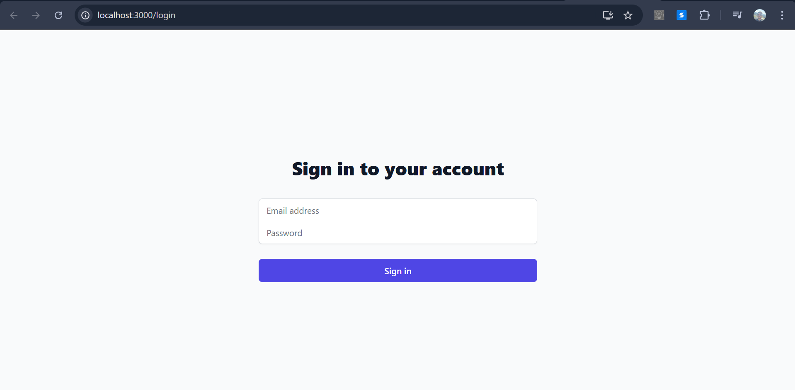
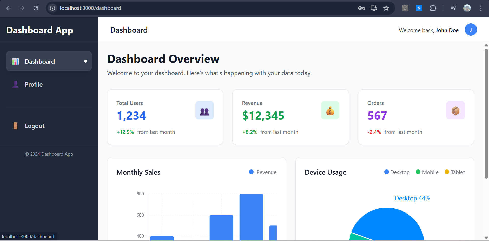
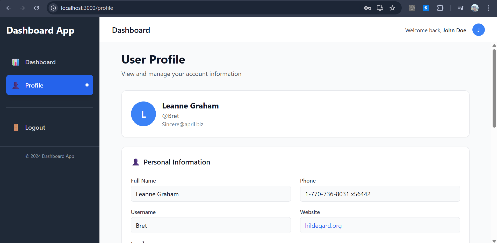
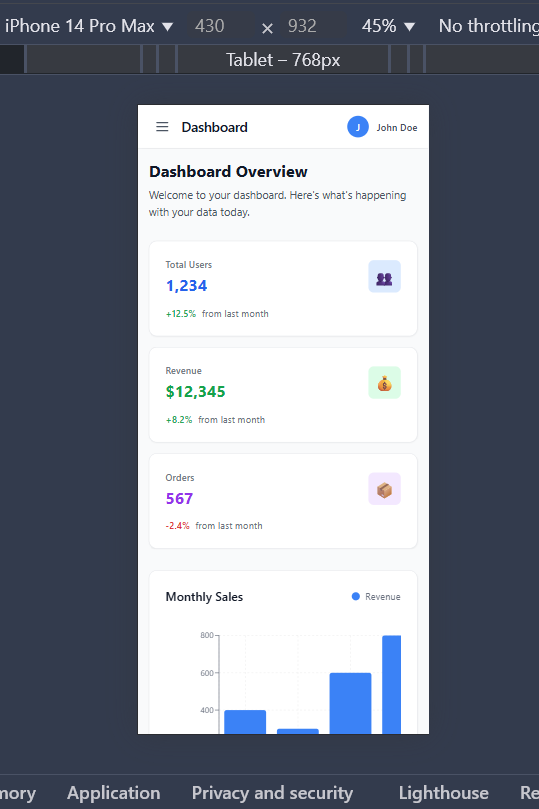
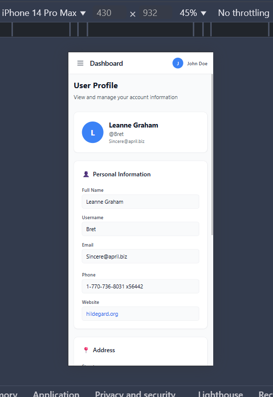

# React Dashboard Application

A modern, responsive dashboard application built with React.js featuring authentication, data visualization, and API integration.

## 📋 Table of Contents

- [Features](#features)
- [Tech Stack](#tech-stack)
- [Prerequisites](#prerequisites)
- [Installation](#installation)
- [Usage](#usage)
- [Project Structure](#project-structure)
- [API Integration](#api-integration)
- [Screenshots](#screenshots)
- [Contributing](#contributing)
- [License](#license)

## ✨ Features

- 🔐 **Authentication System**: Login/Signup with form validation and mock authentication
- 📊 **Interactive Dashboard**: Data visualization with charts and metrics cards
- 👤 **User Profile**: Display user information fetched from API
- 📱 **Responsive Design**: Mobile-first design that works on all devices
- 🎨 **Modern UI**: Clean, professional interface built with Tailwind CSS
- 🔄 **State Management**: Context API for centralized state management
- 🛣️ **Routing**: Protected routes with React Router
- 📡 **API Integration**: Real-time data fetching from JSONPlaceholder

## 🛠️ Tech Stack

### Frontend Framework
- **React** (v19.1.1) - Modern JavaScript library for building user interfaces
- **React DOM** (v19.1.1) - React rendering library

### Routing & Navigation
- **React Router DOM** (v6.30.1) - Declarative routing for React

### Styling
- **Tailwind CSS** (v3.4.17) - Utility-first CSS framework
- **PostCSS** (v8.5.6) - CSS processing tool
- **Autoprefixer** (v10.4.21) - CSS vendor prefixing

### Data Visualization
- **Recharts** (v3.1.2) - Composable charting library built on React components

### HTTP Client
- **Axios** (v1.11.0) - Promise-based HTTP client for the browser

### Build Tools
- **React Scripts** (v5.0.1) - Build scripts and development server
- **Web Vitals** (v5.1.0) - Library for measuring web performance

## 📋 Prerequisites

Before running this project, make sure you have the following installed:

- **Node.js** (v16 or higher) - JavaScript runtime
- **npm** (v7 or higher) - Package manager

You can check your versions by running:
```bash
node --version
npm --version
```

## 🚀 Installation

1. **Clone the repository** (if applicable) or navigate to the project directory:
   ```bash
   cd dashboard-app
   ```

2. **Install dependencies**:
   ```bash
   npm install
   ```

3. **Start the development server**:
   ```bash
   npm start
   ```

4. **Open your browser** and navigate to:
   ```
   http://localhost:3000
   ```

## 📖 Usage

### Authentication
- Visit the application and you'll be redirected to the login page
- Use any email and password combination to log in (mock authentication)
- Alternatively, click "Sign up" to create a new account

### Navigation
- Use the sidebar to navigate between Dashboard and Profile pages
- The top navbar shows user information and logout option
- All routes are protected - unauthenticated users are redirected to login

### Dashboard Features
- View key metrics in the summary cards
- Interact with the bar chart showing monthly sales data
- Explore the pie chart displaying device usage statistics
- All charts are responsive and built with Recharts

### User Profile
- View detailed user information fetched from the API
- Information includes personal details, address, and company information

## 📁 Project Structure

```
dashboard-app/
├── public/
│   ├── favicon.ico
│   ├── index.html
│   ├── logo192.png
│   ├── logo512.png
│   ├── manifest.json
│   └── robots.txt
├── src/
│   ├── components/
│   │   ├── Navbar.js          # Top navigation bar
│   │   └── Sidebar.js         # Side navigation menu
│   ├── context/
│   │   ├── AuthContext.js     # Authentication state management
│   │   └── DataContext.js     # API data state management
│   ├── pages/
│   │   ├── Dashboard.js       # Main dashboard with charts
│   │   ├── Login.js           # Login page
│   │   ├── Profile.js         # User profile page
│   │   └── Signup.js          # Signup page
│   ├── utils/
│   │   └── index.js           # Utility functions
│   ├── App.js                 # Main application component
│   ├── App.css                # Application styles
│   ├── index.css              # Global styles with Tailwind
│   ├── index.js               # Application entry point
│   ├── logo.svg               # React logo
│   ├── reportWebVitals.js     # Performance monitoring
│   └── setupTests.js          # Test configuration
├── .gitignore                 # Git ignore rules
├── package.json               # Project dependencies and scripts
├── postcss.config.js          # PostCSS configuration
├── README.md                  # Project documentation
├── tailwind.config.js         # Tailwind CSS configuration
└── yarn.lock                  # Dependency lock file
```

## 🔗 API Integration

This application integrates with [JSONPlaceholder](https://jsonplaceholder.typicode.com/), a free REST API for testing and prototyping.

### Endpoints Used

- **GET /users** - Fetch user data for profile display
- **GET /posts** - Fetch posts data (available for future features)

### API Features

- Automatic data fetching on component mount
- Error handling with user-friendly messages
- Loading states during API calls
- Centralized API management through DataContext

## 📸 Screenshots

### Login Page



### Dashboard



### User Profile



### Mobile View





## 🤝 Contributing

Contributions are welcome! Please follow these steps:

1. Fork the repository
2. Create a feature branch: `git checkout -b feature-name`
3. Commit your changes: `git commit -m 'Add some feature'`
4. Push to the branch: `git push origin feature-name`
5. Open a Pull Request

### Development Guidelines

- Follow React best practices and hooks guidelines
- Use meaningful component and variable names
- Add comments for complex logic
- Test your changes thoroughly
- Ensure responsive design works on all screen sizes

## 📄 License

This project is licensed under the MIT License - see the [LICENSE](LICENSE) file for details.


**Built with ❤️ using React.js**
